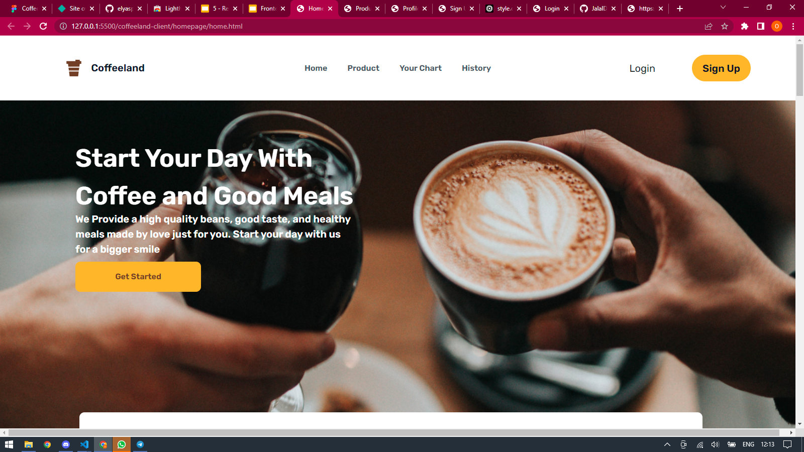

# Coffeland


## BUILT WITH


## HOW TO INSTALL

1. Clone this repository.
   ```
   $ git clone https://github.com/JalalDA/coffeland-frontend
   ```
2. Open VS Code or you can download and install it [here](https://code.visualstudio.com/).
3. To make it easier, you can install Live Server Extension for VS Code [here](https://marketplace.visualstudio.com/items?itemName=ritwickdey.LiveServer).
4. Right click on _index.html_ then choose **Open with Live Server** menu.

## PREVIEW

<div style="display:flex">



</div>

## RELATED PROJECT

[gargyo-coffee-backend](https://github.com/JalalDA/coffeeland)
